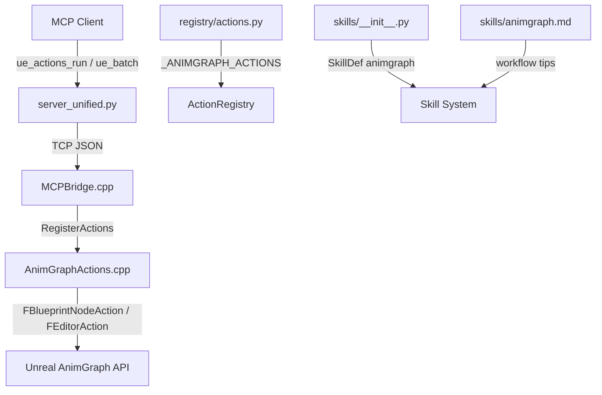

# 技术设计文档：动画图（AnimGraph）MCP 完整操作扩展

## 概述

本设计为 UE Editor MCP 插件新增 AnimGraph 完整操作能力（读取、创建、修改、编译）。遵循现有架构模式（C++ Action → Python Registry → Skill System），新增约 14 个 C++ Action 和对应的 Python ActionDef，使 AI 能通过 MCP 协议读取动画蓝图的 AnimGraph 结构、创建动画蓝图和状态机、添加/删除/修改状态和转换规则、添加动画节点、连接/断开节点、设置节点属性，以及编译动画蓝图。

### 设计决策

1. **读写分离**：只读 Action 的 `RequiresSave()` 返回 `false`；写入/修改 Action 使用基类默认值（返回 `true`），触发自动保存。
2. **继承 FBlueprintNodeAction**：复用现有的 `ValidateBlueprint` / `GetTargetBlueprint` / `FindGraph` 基础设施。AnimGraph 本质上也是 `UEdGraph` 子图。创建动画蓝图的 Action 继承 `FEditorAction`（不需要已有蓝图）。
3. **单文件 C++ 实现**：所有 AnimGraph Action 放在 `AnimGraphActions.cpp/h` 中，与 `GraphActions`、`NodeActions` 等保持一致的文件组织。
4. **animgraph.* 命名空间**：Python 端 action_id 使用 `animgraph.` 前缀，与现有 `blueprint.*`、`graph.*` 等域保持一致。
5. **复用 graph.describe_enhanced 的序列化模式**：节点/引脚/边的 JSON 序列化格式与 `FGraphDescribeEnhancedAction` 保持一致（支持 compact 模式），降低 AI 学习成本。
6. **Skill id 为 "animgraph"**：涵盖读取、写入、修改、编译全部操作，不再区分 read-only skill。
7. **Python capabilities 区分**：只读 Action 的 `capabilities=("read",)`，写入 Action 的 `capabilities=("write",)`，删除操作的 `capabilities=("write", "destructive")`。

## 架构



### 数据流

1. AI 调用 `ue_skills(load, "animgraph")` 获取所有 animgraph action 的 schema
2. AI 调用 `ue_actions_run(action_id="animgraph.create_blueprint", params={name: "ABP_Player", skeleton: "/Game/Characters/SK_Mannequin"})` 创建动画蓝图
3. Python `server_unified.py` 通过 registry 解析 action_id → C++ command `create_anim_blueprint`
4. TCP 发送到 C++ `FCreateAnimBlueprintAction::ExecuteInternal()`
5. C++ 使用 `UAnimBlueprintFactory` 创建动画蓝图资产，序列化结果为 JSON 返回

## 组件与接口

### C++ Action 类（AnimGraphActions.h/cpp）

#### 读取 Action（RequiresSave = false）

| Action 类 | C++ Command | Action ID | 功能 |
|-----------|-------------|-----------|------|
| `FListAnimGraphGraphsAction` | `list_animgraph_graphs` | `animgraph.list_graphs` | 列出动画蓝图所有图的概览 |
| `FDescribeAnimGraphTopologyAction` | `describe_animgraph_topology` | `animgraph.describe_topology` | 描述指定图的节点拓扑 |
| `FGetStateMachineStructureAction` | `get_state_machine_structure` | `animgraph.get_state_machine` | 读取状态机完整结构 |
| `FGetStateSubgraphAction` | `get_state_subgraph` | `animgraph.get_state_subgraph` | 读取状态内部子图拓扑 |
| `FGetTransitionRuleAction` | `get_transition_rule` | `animgraph.get_transition_rule` | 读取转换规则条件子图 |

#### 写入 Action（RequiresSave = true，使用基类默认值）

| Action 类 | C++ Command | Action ID | 功能 |
|-----------|-------------|-----------|------|
| `FCreateAnimBlueprintAction` | `create_anim_blueprint` | `animgraph.create_blueprint` | 创建动画蓝图 |
| `FAddStateMachineAction` | `add_state_machine` | `animgraph.add_state_machine` | 在 AnimGraph 中添加状态机 |
| `FAddStateAction` | `add_animgraph_state` | `animgraph.add_state` | 在状态机中添加状态 |
| `FRemoveStateAction` | `remove_animgraph_state` | `animgraph.remove_state` | 从状态机中删除状态 |
| `FAddTransitionRuleAction` | `add_transition_rule` | `animgraph.add_transition` | 添加转换规则 |
| `FRemoveTransitionRuleAction` | `remove_transition_rule` | `animgraph.remove_transition` | 删除转换规则 |
| `FAddAnimNodeAction` | `add_anim_node` | `animgraph.add_node` | 添加动画节点 |
| `FSetAnimNodePropertyAction` | `set_anim_node_property` | `animgraph.set_node_property` | 设置动画节点属性 |
| `FConnectAnimNodesAction` | `connect_anim_nodes` | `animgraph.connect_nodes` | 连接 AnimGraph 节点 |
| `FDisconnectAnimNodeAction` | `disconnect_anim_node` | `animgraph.disconnect_node` | 断开 AnimGraph 节点引脚 |
| `FRenameStateAction` | `rename_animgraph_state` | `animgraph.rename_state` | 重命名状态 |
| `FSetTransitionPriorityAction` | `set_transition_priority` | `animgraph.set_transition_priority` | 修改转换规则优先级 |
| `FCompileAnimBlueprintAction` | `compile_anim_blueprint` | `animgraph.compile` | 编译动画蓝图 |

### 继承关系

```
FEditorAction
├── FCreateAnimBlueprintAction          // 不需要已有蓝图
└── FBlueprintAction
    └── FBlueprintNodeAction
        ├── FListAnimGraphGraphsAction       // 只读
        ├── FDescribeAnimGraphTopologyAction // 只读
        ├── FGetStateMachineStructureAction  // 只读
        ├── FGetStateSubgraphAction          // 只读
        ├── FGetTransitionRuleAction         // 只读
        ├── FAddStateMachineAction           // 写入
        ├── FAddStateAction                  // 写入
        ├── FRemoveStateAction               // 写入
        ├── FAddTransitionRuleAction         // 写入
        ├── FRemoveTransitionRuleAction      // 写入
        ├── FAddAnimNodeAction               // 写入
        ├── FSetAnimNodePropertyAction       // 写入
        ├── FConnectAnimNodesAction          // 写入
        ├── FDisconnectAnimNodeAction        // 写入
        ├── FRenameStateAction               // 写入
        ├── FSetTransitionPriorityAction     // 写入
        └── FCompileAnimBlueprintAction      // 写入（显式保存）
```

### C++ 辅助方法（AnimGraphActions 内部）

```cpp
namespace AnimGraphHelpers
{
    // 验证蓝图是否为 UAnimBlueprint，失败时设置 OutError
    bool ValidateAnimBlueprint(UBlueprint* Blueprint, FString& OutError);

    // 在动画蓝图中按名称查找子图（AnimGraph、StateMachine、State 子图）
    UEdGraph* FindAnimSubGraph(UAnimBlueprint* AnimBP, const FString& GraphName, FString& OutError);

    // 在状态机图中查找状态节点
    UAnimStateNodeBase* FindStateNode(UEdGraph* StateMachineGraph, const FString& StateName, FString& OutError);

    // 在状态机图中查找转换规则节点
    UAnimStateTransitionNode* FindTransitionNode(UEdGraph* StateMachineGraph,
        const FString& SourceState, const FString& TargetState, FString& OutError);

    // 序列化节点（复用 FGraphDescribeEnhancedAction 的 compact/enhanced 模式）
    TSharedPtr<FJsonObject> SerializeAnimNode(const UEdGraphNode* Node, bool bCompact);

    // 识别动画资产引用（AnimSequence、BlendSpace 等）并添加到节点 JSON
    void ExtractAnimAssetReferences(const UEdGraphNode* Node, TSharedPtr<FJsonObject>& OutNodeObj);

    // 根据节点类型字符串创建对应的动画图节点
    UAnimGraphNode_Base* CreateAnimNodeByType(UEdGraph* Graph, const FString& NodeType,
        FVector2D Position, const TSharedPtr<FJsonObject>& Params, FString& OutError);
}
```

### Python 端组件

| 文件 | 变更 |
|------|------|
| `registry/actions.py` | 新增 `_ANIMGRAPH_ACTIONS` 列表（约 18 个 ActionDef），在 `register_all_actions()` 中注册 |
| `skills/__init__.py` | 新增 `SkillDef(id="animgraph", ...)` 包含所有 animgraph action_id |
| `skills/animgraph.md` | 新增工作流提示文件，涵盖读取、创建、修改、编译工作流 |
| `tests/test_animgraph.py` | 新增 AnimGraph 专项测试 |

### UE Build 模块依赖

需要在 `UEEditorMCP.Build.cs` 的 `PrivateDependencyModuleNames` 中添加：

```csharp
"AnimGraph",           // UAnimGraphNode 基类、状态机节点类型
"AnimGraphRuntime",    // 运行时动画节点类型定义
```

这两个模块均为 Editor-time 模块，不会引入运行时依赖。

## 数据模型

### Action 输入/输出 Schema

#### 1. animgraph.list_graphs（只读）

**输入：**
```json
{
  "blueprint_name": "ABP_Player",
  "asset_path": "/Game/Blueprints/ABP_Player"
}
```

**输出：**
```json
{
  "success": true,
  "blueprint_name": "ABP_Player",
  "skeleton": "/Game/Characters/SK_Mannequin",
  "parent_class": "UAnimInstance",
  "graphs": [
    { "graph_name": "AnimGraph", "graph_type": "AnimGraph", "node_count": 12 },
    { "graph_name": "EventGraph", "graph_type": "EventGraph", "node_count": 5 },
    { "graph_name": "Locomotion", "graph_type": "StateMachine", "node_count": 8 }
  ]
}
```

#### 2. animgraph.describe_topology（只读）

**输入：**
```json
{
  "blueprint_name": "ABP_Player",
  "graph_name": "AnimGraph",
  "compact": true
}
```

**输出：** 与 `graph.describe_enhanced` 格式一致的节点/引脚/边拓扑，额外包含动画资产引用。

#### 3. animgraph.get_state_machine（只读）

**输入：**
```json
{
  "blueprint_name": "ABP_Player",
  "state_machine_name": "Locomotion"
}
```

**输出：**
```json
{
  "success": true,
  "state_machine_name": "Locomotion",
  "entry_state": "Idle",
  "states": [
    { "state_name": "Idle", "state_type": "State", "node_guid": "...", "subgraph_node_count": 3 },
    { "state_name": "Walk", "state_type": "State", "node_guid": "...", "subgraph_node_count": 5 }
  ],
  "transitions": [
    { "source_state": "Idle", "target_state": "Walk", "transition_guid": "...", "priority": 1 },
    { "source_state": "Walk", "target_state": "Idle", "transition_guid": "...", "priority": 1 }
  ]
}
```

#### 4. animgraph.get_state_subgraph（只读）

**输入：**
```json
{
  "blueprint_name": "ABP_Player",
  "state_machine_name": "Locomotion",
  "state_name": "Idle"
}
```

**输出：** 节点拓扑（同 describe_topology 格式），额外标注 AnimSequence/BlendSpace 资产路径。

#### 5. animgraph.get_transition_rule（只读）

**输入：**
```json
{
  "blueprint_name": "ABP_Player",
  "state_machine_name": "Locomotion",
  "source_state": "Idle",
  "target_state": "Walk"
}
```

**输出：** 转换规则子图的节点拓扑，标注引用的蓝图变量名称。

#### 6. animgraph.create_blueprint（写入）

**输入：**
```json
{
  "name": "ABP_Player",
  "skeleton": "/Game/Characters/SK_Mannequin",
  "parent_class": "AnimInstance",
  "path": "/Game/Blueprints"
}
```

**输出：**
```json
{
  "success": true,
  "name": "ABP_Player",
  "path": "/Game/Blueprints/ABP_Player",
  "skeleton": "SK_Mannequin",
  "parent_class": "AnimInstance"
}
```

#### 7. animgraph.add_state_machine（写入）

**输入：**
```json
{
  "blueprint_name": "ABP_Player",
  "state_machine_name": "Locomotion",
  "node_position": [200, 100]
}
```

**输出：**
```json
{
  "success": true,
  "state_machine_name": "Locomotion",
  "node_guid": "..."
}
```

#### 8. animgraph.add_state / animgraph.remove_state（写入）

**add_state 输入：**
```json
{
  "blueprint_name": "ABP_Player",
  "state_machine_name": "Locomotion",
  "state_name": "Run",
  "node_position": [300, 200]
}
```

**remove_state 输入：**
```json
{
  "blueprint_name": "ABP_Player",
  "state_machine_name": "Locomotion",
  "state_name": "Run"
}
```

#### 9. animgraph.add_transition / animgraph.remove_transition（写入）

**add_transition 输入：**
```json
{
  "blueprint_name": "ABP_Player",
  "state_machine_name": "Locomotion",
  "source_state": "Idle",
  "target_state": "Walk"
}
```

**remove_transition 输入：**
```json
{
  "blueprint_name": "ABP_Player",
  "state_machine_name": "Locomotion",
  "source_state": "Idle",
  "target_state": "Walk"
}
```

#### 10. animgraph.add_node（写入）

**输入：**
```json
{
  "blueprint_name": "ABP_Player",
  "graph_name": "AnimGraph",
  "node_type": "AnimSequencePlayer",
  "anim_asset": "/Game/Animations/Idle_Anim",
  "node_position": [400, 200]
}
```

支持的 node_type：
- `AnimSequencePlayer` — 动画序列播放
- `BlendSpacePlayer` — 混合空间播放
- `LayeredBlendPerBone` — 按骨骼分层混合
- `TwoWayBlend` — 双向混合
- `BlendPosesByBool` — 布尔混合
- `BlendPosesByInt` — 整数混合

#### 11. animgraph.set_node_property（写入）

**输入：**
```json
{
  "blueprint_name": "ABP_Player",
  "graph_name": "AnimGraph",
  "node_guid": "...",
  "property_name": "Sequence",
  "property_value": "/Game/Animations/Run_Anim"
}
```

#### 12. animgraph.connect_nodes / animgraph.disconnect_node（写入）

**connect_nodes 输入：**
```json
{
  "blueprint_name": "ABP_Player",
  "graph_name": "AnimGraph",
  "source_node_id": "...",
  "source_pin": "Pose",
  "target_node_id": "...",
  "target_pin": "Pose"
}
```

**disconnect_node 输入：**
```json
{
  "blueprint_name": "ABP_Player",
  "graph_name": "AnimGraph",
  "node_guid": "...",
  "pin_name": "Pose"
}
```

#### 13. animgraph.rename_state / animgraph.set_transition_priority（写入）

**rename_state 输入：**
```json
{
  "blueprint_name": "ABP_Player",
  "state_machine_name": "Locomotion",
  "old_name": "Walk",
  "new_name": "Walking"
}
```

**set_transition_priority 输入：**
```json
{
  "blueprint_name": "ABP_Player",
  "state_machine_name": "Locomotion",
  "source_state": "Idle",
  "target_state": "Walk",
  "priority": 2
}
```

#### 14. animgraph.compile（写入）

**输入：**
```json
{
  "blueprint_name": "ABP_Player"
}
```

**输出：**
```json
{
  "success": true,
  "name": "ABP_Player",
  "compiled": true,
  "status": "UpToDate",
  "error_count": 0,
  "warning_count": 0,
  "saved_packages_count": 1
}
```

### Python ActionDef Schema

每个 ActionDef 遵循现有模式：
- `id`: `animgraph.*` 命名空间
- `command`: 对应 C++ command 字符串
- `tags`: 包含 `"animgraph"`, `"animation"` 等
- `capabilities`: 只读为 `("read",)`，写入为 `("write",)`，删除为 `("write", "destructive")`
- `risk`: 只读为 `"safe"`，写入为 `"safe"` 或 `"moderate"`，删除为 `"moderate"`
- `input_schema`: JSON Schema 对象
- `examples`: 至少一个使用示例


## 正确性属性（Correctness Properties）

*属性是在系统所有有效执行中都应成立的特征或行为——本质上是关于系统应该做什么的形式化陈述。属性是人类可读规范与机器可验证正确性保证之间的桥梁。*

### Property 1: ActionDef 结构正确性

*For all* 以 `animgraph.` 为前缀的 ActionDef，其 `id` 应匹配 `animgraph\.\w+` 正则模式，且应包含非空的 `command`（字符串）、`tags`（元组，至少包含 `"animgraph"`）、`description`（非空字符串）、`input_schema`（包含 `"type": "object"` 的字典）和 `examples`（非空元组）字段。

**Validates: Requirements 16.1, 16.4**

### Property 2: Capabilities 分类正确性

*For all* 以 `animgraph.` 为前缀的 ActionDef，只读操作（list_graphs、describe_topology、get_state_machine、get_state_subgraph、get_transition_rule）的 `capabilities` 应为 `("read",)`，写入操作（create_blueprint、add_state_machine、add_state、add_transition、add_node、set_node_property、connect_nodes、disconnect_node、rename_state、set_transition_priority、compile）的 `capabilities` 应包含 `"write"`，删除操作（remove_state、remove_transition）的 `capabilities` 应包含 `"write"` 和 `"destructive"`。

**Validates: Requirements 16.2**

### Property 3: input_schema JSON 序列化 round-trip

*For all* 新注册的 animgraph ActionDef，对其 `input_schema` 执行 `json.loads(json.dumps(schema))` 应产生与原始 schema 等价的 JSON 对象。

**Validates: Requirements 18.4**

## 错误处理

### C++ 端错误处理

| 错误场景 | 错误类型 | 错误消息模式 |
|----------|----------|-------------|
| 蓝图不存在 | `not_found` | `Blueprint '{name}' not found` |
| 蓝图不是动画蓝图 | `invalid_type` | `Blueprint '{name}' is not an Animation Blueprint` |
| 图名称不存在 | `not_found` | `Graph '{name}' not found in '{bp}'. Available: [...]` |
| 状态机不存在 | `not_found` | `State machine '{name}' not found. Available: [...]` |
| 状态不存在 | `not_found` | `State '{name}' not found in state machine '{sm}'. Available: [...]` |
| 转换规则不存在 | `not_found` | `Transition from '{src}' to '{dst}' not found in '{sm}'` |
| 同名状态已存在 | `duplicate` | `State '{name}' already exists in state machine '{sm}'` |
| 同名状态机已存在 | `duplicate` | `State machine '{name}' already exists` |
| 同方向转换已存在 | `duplicate` | `Transition from '{src}' to '{dst}' already exists` |
| 不能删除入口状态 | `invalid_operation` | `Cannot remove entry state '{name}'` |
| 骨骼网格体不存在 | `not_found` | `Skeleton asset not found: '{path}'` |
| 动画资产不存在 | `not_found` | `Animation asset not found: '{path}'` |
| 引脚类型不兼容 | `type_mismatch` | `Pin type mismatch: '{src_pin}' ({src_type}) → '{dst_pin}' ({dst_type})` |
| 节点不存在 | `not_found` | `Node not found with GUID: '{guid}'` |
| 引脚不存在 | `not_found` | `Pin '{name}' not found on node. Available: [...]` |
| 属性不存在 | `not_found` | `Property '{name}' not found on node. Available: [...]` |
| 编译失败 | `compilation_failed` | `Animation Blueprint '{name}' compilation failed with {n} error(s)` |
| 不支持的节点类型 | `invalid_type` | `Unsupported anim node type: '{type}'. Supported: [...]` |

所有错误响应遵循现有格式：
```json
{"success": false, "error": "...", "error_type": "..."}
```

### 错误恢复策略

- 只读 Action 不存在需要回滚的场景
- 写入 Action 在 `Validate()` 阶段进行前置条件检查，防止无效输入到达 `ExecuteInternal()`
- 图/状态/转换查找失败时，列出可用选项帮助 AI 自动纠正
- 编译 Action 复用现有 `FCompileBlueprintAction` 的消息收集逻辑
- 所有 Action 通过基类 `ExecuteWithCrashProtection()` 获得 SEH 崩溃保护

## 测试策略

### 双重测试方法

本功能采用单元测试 + 属性测试的双重策略：

- **单元测试**：验证具体示例、边界条件和错误处理
- **属性测试**：验证跨所有输入的通用属性

### 属性测试配置

- 使用 **Hypothesis** 库（Python 属性测试标准库）
- 每个属性测试最少运行 **100 次迭代**
- 每个测试用注释标注对应的设计属性：`# Feature: animation-graph-read, Property {N}: {title}`
- 每个正确性属性由**单个**属性测试实现

### 测试文件结构

#### tests/test_animgraph.py（新增）

**属性测试**（基于 Hypothesis）：

1. **Property 1 测试**：遍历所有 `animgraph.*` ActionDef，验证结构正确性（id 命名规范、必需字段非空、tags 包含 animgraph、input_schema 包含 type:object）
   - `# Feature: animation-graph-read, Property 1: ActionDef 结构正确性`

2. **Property 2 测试**：遍历所有 `animgraph.*` ActionDef，根据已知的读/写/删除分类验证 capabilities 字段
   - `# Feature: animation-graph-read, Property 2: Capabilities 分类正确性`

3. **Property 3 测试**：对所有 animgraph ActionDef 的 input_schema 执行 JSON round-trip 验证
   - `# Feature: animation-graph-read, Property 3: input_schema JSON 序列化 round-trip`

**单元测试**：

4. 验证所有 animgraph action_id 在 registry 中存在
5. 验证 animgraph skill 可以成功加载且包含所有 animgraph action_id
6. 验证 animgraph workflow 文件（animgraph.md）存在

#### 现有测试兼容性

- `test_schema_contract.py`：新增的 C++ Action 注册和 Python ActionDef 将自动被现有测试覆盖（验证 Python tool schema ↔ C++ Action 一致性）
- `test_skills.py`：新增的 SkillDef 和 workflow 文件将自动被现有测试覆盖（验证 skill 中引用的 action_id 在 registry 中存在、所有 registry action 被 skill 覆盖、workflow 文件存在）

### C++ 端测试

C++ Action 的正确性依赖于 Unreal Editor 运行时环境，无法在离线单元测试中验证。通过以下方式保证：

1. Python 端 schema contract 测试确保 Python ↔ C++ 接口一致
2. 手动集成测试：在 UE Editor 中加载动画蓝图并执行各 Action
3. `Validate()` 方法提供前置条件检查，防止无效输入到达 `ExecuteInternal()`
