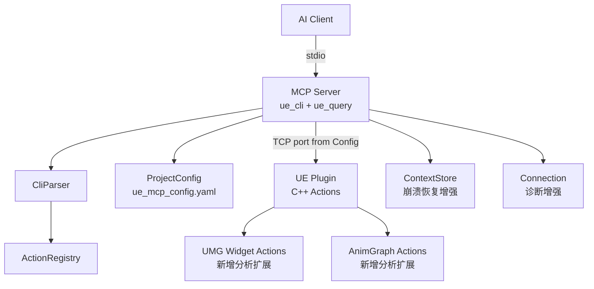
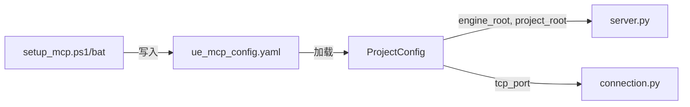
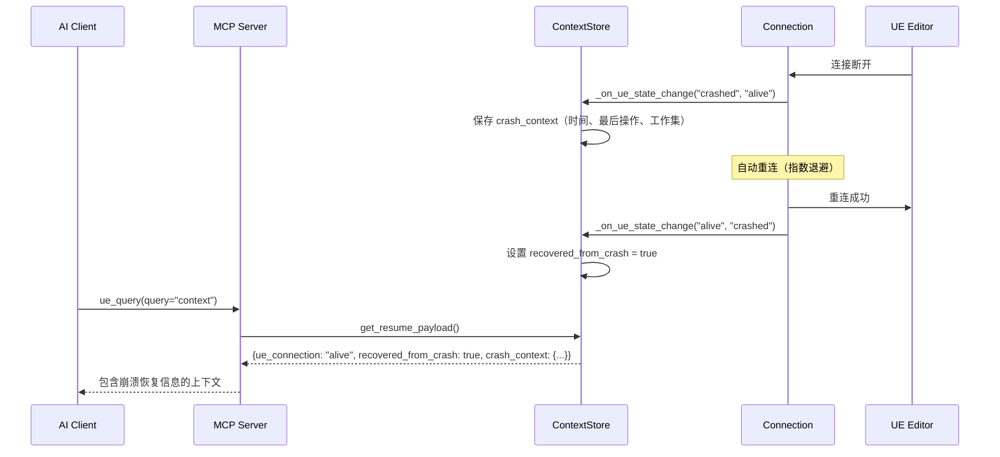

# 设计文档：v0.4.0 平台扩展

## 概述

本设计文档覆盖 v0.4.0 版本的七大改进方向，目标是在现有 CLI-native MCP 架构上进行增量扩展，保持 2-tool（`ue_cli` + `ue_query`）的极简接口不变。

**核心设计原则：**
- **零手工维护表**：所有新增 Action 通过 ActionRegistry 自动注册，CLI 参数映射从 `input_schema.required` 自动推导
- **增量扩展**：新功能以独立模块/文件添加，不修改现有核心架构
- **可离线测试**：Python 层逻辑（解析、配置、注册表）可在无 UE 编辑器环境下完整测试

**变更范围：**

| 模块 | 变更类型 | 影响文件 |
|------|---------|---------|
| 项目配置系统 | 新增 | `Python/ue_cli_tool/config.py`, `setup_mcp.ps1`, `setup_mcp.bat` |
| 多编辑器实例 | 修改 | `connection.py`, `server.py`, C++ `MCPServer.cpp` |
| UMG Widget 分析 | 新增 | C++ `UMGWidgetAnalysisActions.cpp`, `registry/actions.py` |
| 动画蓝图增强 | 新增 | C++ `AnimAnalysisActions.cpp`, `registry/actions.py` |
| CLI 语法增强 | 修改 | `cli_parser.py` |
| 测试覆盖补全 | 新增 | `tests/test_connection.py`, `tests/test_pipeline.py`, `tests/test_command_proxy.py`, `tests/test_server.py` |
| 错误恢复与诊断 | 修改 | `connection.py`, `context.py`, `server.py` |

## 架构

### 整体架构（不变）



### 新增模块：ProjectConfig



ProjectConfig 作为新的配置层，位于 `server.py` 启动流程的最前端。启动时从工作区根目录向上搜索 `ue_mcp_config.yaml`，加载后将配置注入到 Connection（端口）和 ContextStore（路径信息）。

### CLI 语法增强

在现有 `CliParser._coerce_value()` 基础上扩展，新增两种简写语法：

```
# 数组简写（逗号分隔）
--items a,b,c          → ["a", "b", "c"]
--values 1,2,3         → [1, 2, 3]

# 键值对简写
--props name=Sword,damage=50  → {"name": "Sword", "damage": 50}
```

关键设计决策：简写语法的解析需要 Schema 类型信息。`_coerce_value()` 当前是无 Schema 感知的静态方法。新增 `_coerce_value_with_schema()` 方法，在有 Schema 信息时使用类型感知解析，无 Schema 时回退到现有行为。

## 组件与接口

### 1. ProjectConfig（新增）

**文件：** `Python/ue_cli_tool/config.py`

```python
@dataclass
class ProjectConfig:
    engine_root: str | None = None
    project_root: str | None = None
    tcp_port: int = 55558
    lua_script_dirs: list[str] = field(default_factory=list)
    extra_action_paths: list[str] = field(default_factory=list)

def load_config(start_dir: Path | None = None) -> ProjectConfig:
    """从 start_dir 向上搜索 ue_mcp_config.yaml 并加载。
    找不到文件时返回默认配置。"""

def save_config(config: ProjectConfig, path: Path) -> None:
    """将配置序列化为 YAML 并写入文件。"""

def merge_config(existing: ProjectConfig, updates: dict) -> ProjectConfig:
    """合并新检测到的值与已有配置，保留用户手动添加的配置项。"""
```

**配置文件格式（YAML）：**
```yaml
engine_root: "E:/EpicGame/UE_5.7"
project_root: "E:/Projects/MyGame"
tcp_port: 55558
lua_script_dirs:
  - "Scripts/Lua"
extra_action_paths: []
```

**搜索策略：** 从当前工作目录开始，逐级向上搜索 `ue_mcp_config.yaml`，直到文件系统根目录。首个找到的文件即为项目配置。

### 2. CLI Parser 扩展

**文件：** `Python/ue_cli_tool/cli_parser.py`

新增方法：

```python
def _coerce_value_with_schema(
    self, val: str, param_name: str, command: str
) -> Any:
    """Schema 感知的值转换。
    
    当 Schema 类型为 array 且值包含逗号时，解析为数组。
    当 Schema 类型为 object 且值包含 key=value 时，解析为对象。
    无 Schema 信息时回退到 _coerce_value()。
    """
```

解析优先级：
1. 如果值以 `[` 或 `{` 开头 → 现有 JSON 解析（保持兼容）
2. 如果 Schema 类型为 `array` 且值包含 `,` → 逗号分隔解析
3. 如果 Schema 类型为 `object` 且值包含 `=` → 键值对解析
4. 否则 → 现有 `_coerce_value()` 行为

### 3. UMG Widget 分析扩展（C++ 新增 Action）

**文件：** `Source/UECliTool/Private/Actions/UMGWidgetAnalysisActions.cpp`

| Action | 命令 | 功能 |
|--------|------|------|
| `FDescribeWidgetBlueprintFullAction` | `describe_widget_blueprint_full` | Widget 全景快照 |
| `FWidgetListAnimationsAction` | `widget_list_animations` | 列出 UMG 动画 |
| `FWidgetCreateAnimationAction` | `widget_create_animation` | 创建 UMG 动画 |
| `FWidgetAddAnimationTrackAction` | `widget_add_animation_track` | 添加动画属性轨道 |
| `FWidgetGetReferencesAction` | `widget_get_references` | 查询引用的子 Widget |
| `FWidgetGetReferencersAction` | `widget_get_referencers` | 查询被引用关系 |
| `FWidgetBatchGetStylesAction` | `widget_batch_get_styles` | 批量查询样式属性 |

所有新 Action 继承 `FEditorAction`，遵循现有 Validate → ExecuteInternal 模式。Widget 查找复用 `UMGCommonHelpers.h` 中的 `FindWidgetBlueprintByName()` 辅助函数。

### 4. 动画蓝图分析扩展（C++ 新增 Action）

**文件：** `Source/UECliTool/Private/Actions/AnimAnalysisActions.cpp`

| Action | 命令 | 功能 |
|--------|------|------|
| `FDescribeAnimBlueprintFullAction` | `describe_anim_blueprint_full` | 动画蓝图全景快照 |
| `FAnimDescribeMontageAction` | `anim_describe_montage` | Montage 结构查询 |
| `FAnimDescribeBlendSpaceAction` | `anim_describe_blendspace` | BlendSpace 结构查询 |
| `FAnimListNotifiesAction` | `anim_list_notifies` | 列出 AnimNotify |
| `FAnimAddNotifyAction` | `anim_add_notify` | 添加 AnimNotify |
| `FAnimRemoveNotifyAction` | `anim_remove_notify` | 移除 AnimNotify |
| `FAnimGetSkeletonHierarchyAction` | `anim_get_skeleton_hierarchy` | 骨骼层级查询 |

复用 `AnimGraphHelpers` 命名空间中的辅助函数（`ValidateAnimBlueprint`、`FindAnimSubGraph` 等）。

### 5. Connection 诊断增强

**文件：** `Python/ue_cli_tool/connection.py`

扩展 `get_health()` 返回值：

```python
def get_health(self) -> dict[str, Any]:
    return {
        "connection_state": self._state.value,
        "is_connected": self.is_connected,
        "circuit_breaker": self._circuit.get_status(),
        "last_activity": self._last_activity,
        "reconnect_attempts": self._reconnect_attempts,
        "last_heartbeat_success": self._last_heartbeat_success,  # 新增
        "last_error": self._last_error,  # 新增
        "last_error_time": self._last_error_time,  # 新增
        "consecutive_failures": self._consecutive_cmd_failures,  # 新增
        "config": {
            "host": self.config.host,
            "port": self.config.port,
            "timeout": self.config.timeout,
            "heartbeat_interval": self.config.heartbeat_interval,
        },
    }
```

新增连续失败计数器，当连续 3 次命令失败时在响应中附加健康警告。

### 6. ActionRegistry 注册（Python 侧）

所有新增 C++ Action 需要在 `registry/actions.py` 中添加对应的 `ActionDef` 条目，包含完整的 `input_schema`、`tags`、`examples`。新增约 14 个 ActionDef（7 个 Widget + 7 个 Animation）。

## 数据模型

### ProjectConfig 数据模型

```python
@dataclass
class ProjectConfig:
    engine_root: str | None = None       # UE 引擎根目录
    project_root: str | None = None      # 项目根目录
    tcp_port: int = 55558                # TCP 端口号
    lua_script_dirs: list[str] = field(default_factory=list)
    extra_action_paths: list[str] = field(default_factory=list)
```

**YAML 序列化映射：**
- `None` 值字段不写入 YAML
- 空列表字段不写入 YAML
- 未识别的 YAML 键被忽略（记录 WARNING 日志）

### Widget 全景快照返回结构

```json
{
  "success": true,
  "widget_name": "WBP_HUD",
  "asset_path": "/Game/UI/WBP_HUD",
  "component_tree": {
    "name": "CanvasPanel_0",
    "type": "CanvasPanel",
    "visibility": "Visible",
    "slot": { "position": [0, 0], "size": [0, 0], "auto_size": true },
    "children": [
      {
        "name": "HealthBar",
        "type": "ProgressBar",
        "visibility": "Visible",
        "slot": { "position": [10, 10], "size": [200, 30] },
        "children": []
      }
    ]
  },
  "event_bindings": [
    { "event_name": "OnClicked", "widget_name": "StartButton", "function": "OnStartClicked" }
  ],
  "animations": [
    { "name": "FadeIn", "duration": 0.5, "tracks": ["Opacity"] }
  ],
  "mvvm_bindings": [
    { "widget_property": "Text", "viewmodel_property": "PlayerName", "mode": "OneWay" }
  ],
  "variables": [
    { "name": "bIsVisible", "type": "Boolean", "category": "UI State" }
  ]
}
```

### 动画蓝图全景快照返回结构

```json
{
  "success": true,
  "blueprint_name": "ABP_Character",
  "skeleton": "/Game/Characters/SK_Mannequin",
  "state_machines": [
    {
      "name": "Locomotion",
      "state_count": 4,
      "transition_count": 6,
      "entry_state": "Idle"
    }
  ],
  "anim_asset_references": [
    "/Game/Animations/Idle_Anim",
    "/Game/Animations/Walk_Anim"
  ],
  "variables": [
    { "name": "Speed", "type": "Float" },
    { "name": "bIsInAir", "type": "Boolean" }
  ],
  "event_graph_summary": {
    "node_count": 12,
    "event_nodes": ["EventBlueprintInitializeAnimation", "EventBlueprintUpdateAnimation"]
  }
}
```

### Montage 返回结构

```json
{
  "success": true,
  "montage_name": "AM_Attack",
  "sections": [
    { "name": "Default", "start_time": 0.0, "end_time": 1.2 }
  ],
  "slot_name": "DefaultSlot",
  "notifies": [
    { "name": "HitNotify", "type": "AnimNotify_PlaySound", "trigger_time": 0.5, "track": "1" }
  ],
  "anim_sequences": ["/Game/Animations/Attack_Anim"]
}
```

### Skeleton 层级返回结构

```json
{
  "success": true,
  "skeleton_name": "SK_Mannequin",
  "bones": [
    { "name": "root", "index": 0, "parent_index": -1 },
    { "name": "pelvis", "index": 1, "parent_index": 0 },
    { "name": "spine_01", "index": 2, "parent_index": 1 }
  ]
}
```


## 正确性属性

*属性（Property）是在系统所有有效执行中都应成立的特征或行为——本质上是对系统应做什么的形式化陈述。属性是人类可读规格说明与机器可验证正确性保证之间的桥梁。*

本特性涵盖 7 个可通过属性测试验证的正确性属性。大量 C++ 侧 Action（需求 5-12）需要 UE 编辑器运行环境，不适合属性测试，将通过集成测试覆盖。

### Property 1: ProjectConfig YAML 序列化 round-trip

*For any* 有效的 `ProjectConfig` 对象（包含任意合法的 `engine_root`、`project_root`、`tcp_port`、`lua_script_dirs`、`extra_action_paths` 值），将其序列化为 YAML 字符串再解析回 `ProjectConfig` 对象，应产生与原始对象等价的配置。

**Validates: Requirements 1.6**

### Property 2: 配置合并保留用户自定义项

*For any* 已有的 `ProjectConfig` 对象和任意更新字典，调用 `merge_config(existing, updates)` 后，结果配置中应包含 `updates` 中的所有键值，同时保留 `existing` 中不在 `updates` 中的所有键值。

**Validates: Requirements 2.2**

### Property 3: 数组语法等价性（逗号简写 ≡ JSON）

*For any* 由同类型元素（字符串或数字）组成的数组值，通过逗号简写语法（如 `a,b,c`）解析的结果应与通过 JSON 数组语法（如 `["a","b","c"]`）解析的结果完全等价。

**Validates: Requirements 13.4, 13.1, 13.2, 13.3**

### Property 4: 对象语法等价性（键值对简写 ≡ JSON）

*For any* 由简单键值对组成的对象值（值为字符串或数字），通过键值对简写语法（如 `name=Sword,damage=50`）解析的结果应与通过 JSON 对象语法（如 `{"name":"Sword","damage":50}`）解析的结果完全等价。

**Validates: Requirements 14.3, 14.1, 14.2**

### Property 5: Circuit Breaker 状态转换不变量

*For any* 失败次数 N（N ≥ failure_threshold），从 CLOSED 状态开始连续记录 N 次失败后，Circuit Breaker 状态应为 OPEN；再经过 recovery_timeout 时间后，状态应转换为 HALF_OPEN。

**Validates: Requirements 15.6**

### Property 6: BatchContext pending_count 不变量

*For any* 正整数 N（1 ≤ N ≤ 50）和任意命令名列表，向 `BatchContext` 添加 N 条命令后 `pending_count` 应等于 N；执行后 `pending_count` 应等于 0 且 `is_executed` 应为 True。

**Validates: Requirements 16.3**

### Property 7: CommandProxy 路由完整性

*For any* 已注册的 `ActionDef`，通过 `CommandProxy` 使用其 C++ 命令名（`action.command`）调用 `_resolve_action()` 应成功解析到对应的 `ActionDef`，且解析结果的 `id` 应与原始 `ActionDef.id` 一致。

**Validates: Requirements 17.4**

## 错误处理

### Python 层错误处理

| 场景 | 处理方式 |
|------|---------|
| `ue_mcp_config.yaml` 不存在 | 使用默认 `ProjectConfig`，不报错 |
| `ue_mcp_config.yaml` 格式非法 | 记录 ERROR 日志，回退默认配置 |
| 配置文件含未知键 | 忽略未知键，记录 WARNING 日志 |
| `tcp_port` 超出有效范围 | 记录 WARNING，回退默认端口 55558 |
| CLI 逗号简写解析失败 | 回退到 `_coerce_value()` 原有行为（作为普通字符串） |
| CLI 键值对简写解析失败 | 回退到 `_coerce_value()` 原有行为 |
| 连续 3 次命令失败 | 在下次响应中附加 `_health_warning` 字段 |

### C++ 层错误处理

| 场景 | 处理方式 |
|------|---------|
| Widget Blueprint 不存在 | 返回 `{"success": false, "error": "Widget Blueprint 'X' not found", "asset_path": "..."}` |
| 动画蓝图不存在 | 返回 `{"success": false, "error": "Animation Blueprint 'X' not found", "asset_path": "..."}` |
| Montage/BlendSpace 类型不匹配 | 返回 `{"success": false, "error": "Asset 'X' is not a Y", "expected_type": "Y"}` |
| 动画名称冲突 | 返回 `{"success": false, "error": "Animation 'X' already exists"}` |
| AnimNotify 不存在（移除时） | 返回 `{"success": false, "error": "AnimNotify 'X' not found"}` |
| Skeleton 资产不存在 | 返回 `{"success": false, "error": "Skeleton 'X' not found"}` |
| 端口被占用（C++ 插件） | 日志输出 `"MCP: Port XXXXX is already in use. Try -MCPPort=YYYYY or close the other instance."` |

### 崩溃恢复流程



## 测试策略

### 双轨测试方法

本特性采用**单元测试 + 属性测试**双轨策略：

- **属性测试（Property-Based Testing）**：使用 [Hypothesis](https://hypothesis.readthedocs.io/) 库，验证 7 个正确性属性，每个属性最少 100 次迭代
- **单元测试（Example-Based）**：使用 pytest，覆盖具体示例、边界条件和错误处理
- **集成测试**：C++ Action 相关功能需要 UE 编辑器环境，通过 `test_runtime_e2e.py` 模式覆盖

### 属性测试配置

- **库**：Hypothesis（已在项目中使用，见 `tests/test_materials_analysis_properties.py`）
- **最小迭代次数**：100（通过 `@settings(max_examples=100)` 配置）
- **标签格式**：`Feature: v0.4.0-platform-extensions, Property {N}: {property_text}`

### 测试文件规划

| 测试文件 | 覆盖范围 | 类型 |
|---------|---------|------|
| `tests/test_config.py` | ProjectConfig 加载/保存/合并/round-trip | 属性 + 单元 |
| `tests/test_cli_parser_v04.py` | 数组简写、键值对简写、语法等价性 | 属性 + 单元 |
| `tests/test_connection.py` | Circuit Breaker 状态转换、重连逻辑、_parse_response、超时分层 | 属性 + 单元 |
| `tests/test_pipeline.py` | BatchContext pending_count、AsyncSubmitter | 属性 + 单元 |
| `tests/test_command_proxy.py` | CommandProxy 路由、缓存、错误处理 | 属性 + 单元 |
| `tests/test_server.py` | _handle_cli、_handle_query 集成测试（Mock TCP） | 单元 |

### 属性测试与单元测试的分工

| 测试类型 | 适用场景 | 本特性中的应用 |
|---------|---------|--------------|
| 属性测试 | 输入空间大、存在通用不变量 | 配置 round-trip、语法等价性、状态机转换、路由完整性 |
| 单元测试 | 具体示例、边界条件、错误路径 | 配置文件不存在、非法 YAML、空命令、未知查询 |
| 集成测试 | 需要 UE 编辑器环境 | Widget/Anim C++ Action（需求 5-12） |

### 不适用属性测试的部分

以下部分不使用属性测试：

- **C++ Action 行为**（需求 5-12）：需要 UE 编辑器运行环境，使用集成测试
- **Setup 脚本**（需求 2.1, 2.3）：PowerShell/Batch 脚本行为，使用手动验证
- **端口冲突检测**（需求 4.4, 4.5）：需要 C++ 插件运行环境，使用集成测试
- **崩溃恢复通知**（需求 19.1-19.4）：涉及 Connection 状态回调，使用 example-based 单元测试
- **连接诊断**（需求 20.1-20.3）：测试响应格式，使用 example-based 单元测试
